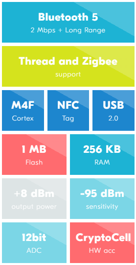
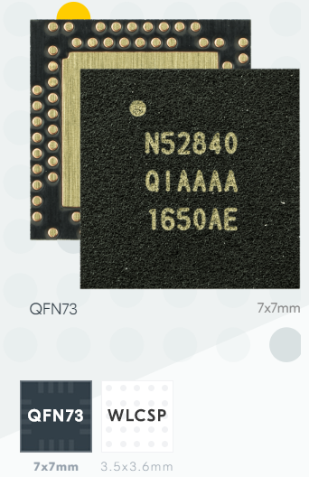

# [nRF52840](https://github.com/sochub/nRF52840) 
 
####  qitas@qitas.cn
#### 归属：[cortex M4](https://github.com/sochub/CM4) 
#### 父级：[nordic](https://github.com/sochub/NRF52) 

### [简介](https://github.com/sochub/nRF52840/wiki)

the most advanced member of the nRF52 Series SoC family. 

* support for Bluetooth 5, Bluetooth mesh, Thread, Zigbee, 802.15.4, ANT and 2.4 GHz proprietary stacks.

* Cortex™-M4 CPU with floating point unit running at 64 MHz. 

* NFC-A Tag for use in simplified pairing and payment solutions.

* The ARM TrustZone® CryptoCell cryptographic unit

* PDM and I2S for digital microphones and audio
 
* full speed USB device for data transfer and power supply for battery recharging.
 
 
 

##  [SoC开发平台](http://www.qitas.cn)  

